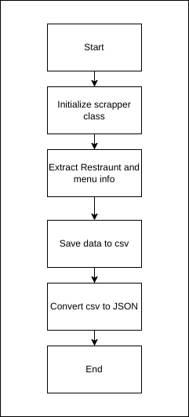
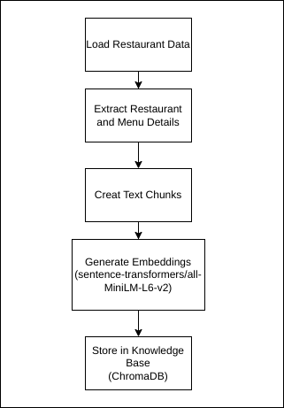
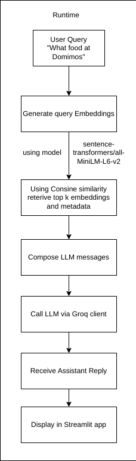

# Zomato Gen AI Internship Assignment

##  Restaurant Data Scraper & RAG-based Chatbot

## Introduction
This project is an end-to-end Generative AI solution that combines web scraping of restaurant data with a Retrieval-Augmented Generation (RAG) chatbot. It aims to enhance user experience by allowing customers to ask natural language questions about restaurants (e.g., menu details, dietary options, price ranges) and receive accurate, contextual answers based on up-to-date information.

## Web Scraping Process

### 1. Overview

The scraper component is responsible for systematically extracting up-to-date restaurant information and menu details from target websites. It navigates through each restaurant page to capture key attributes—such as name, location, contact information, operating hours, ratings—and iterates through all available menu items to record dish names, prices, descriptions, dietary labels, and special features. After gathering raw data, it applies cleaning and validation rules to ensure consistency and accuracy, then outputs a structured JSON file that downstream services (e.g., embedding generators, vector stores) can consume directly.

### 2. Restaurant Selection Process
To ensure meaningful and diverse data for the Generative AI system, a careful restaurant selection strategy was followed. The goal was to collect data across various categories, cuisines, and service types.

**Selection Criteria**:
- **Popularity**: Selected restaurants with a high number of reviews and ratings.
- **Cuisine Diversity**: Included a variety of cuisines (e.g., Indian, Chinese, Italian, Continental, Street Food).
- **Service Types**: Focused on Dine-In, Delivery, and Takeaway options.
- **Price Range**: Covered restaurants across different budget categories — from affordable to premium.
- **Location**: Targeted multiple geographic locations to ensure dataset diversity.
- **Availability of Detailed Information**: Prioritized restaurants with complete details like menu, ratings, reviews, pricing, and photos.

**How Restaurants Were Chosen**:
- Manually shortlisted top restaurants based on filters available on the platform.
- Applied Selenium to dynamically scrape restaurants based on pre-set filters (e.g., cuisine type, budget).

**Selected Restaurants**:

- Bikkgane Biryani
- Maashi Biryani
- McDonald's
- Belgium Waffle
- Domino's Pizza
- La Pino'z Pizza 

### 3. Data Collection Scope

The data collection for this project focuses on gathering detailed information about restaurants, their menus, and customer engagement. The following data points are collected for each restaurant:

1. **Basic Information**:
   - **Restaurant Name**: The name of the restaurant.
   - **Location**: The address or locality where the restaurant is situated.
   - **Phone Number**: Contact number for the restaurant.
   - **Opening Hours**: Operational hours for the restaurant.
   - **Rating**: Customer rating and reviews.

2. **Menu Details**:
   - **Item Name**: Names of the dishes offered.
   - **Price**: The cost of each menu item.
   - **Description**: A brief description of the dish.
   - **Dietary Information**: Categorized as vegetarian or non-vegetarian.
   - **Features**: Special features such as "Best Seller" or "Popular Dish".
   - **Rating**: The rating for each menu item based on customer feedback.

3. **Data Sources**:
   - The data is collected using **Selenium Web Scraping** techniques to extract relevant details in real-time.

4. **Data Formats**:
   - The restaurant information is stored in **CSV** format, while menu data is saved in separate CSV files for each restaurant.
   - The final collection is exported to **JSON** format for easy integration and analysis.

### 4.  Pseudocode for Restaurant Data Scraping
``` Initialize Scraper Class
- Define method to clean restaurant name.
- Define method to clean opening hours.
- Define method to extract restaurant info:
    - Extract name, location, phone number, hours, and rating.
- Define method to extract menu data:
    - Extract name, price, description, dietary type, features, and rating for each item.
- Define method to save menu data into CSV file.

Main Function
- Create a list of restaurants with their URLs and necessary info classes (e.g., name, address, phone, hours, etc.).
- For each restaurant:
    - Extract restaurant info from the website.
    - Extract the menu items from the website.
    - Save restaurant info and menu data into a CSV file.
- Save a summary of all restaurant data into a master CSV file (`restaurants_info.csv`).
```
### 5. Flowchart

### 6. Tools and Technologies

1. **Selenium**: Used for web automation and scraping dynamic content from restaurant websites by simulating browser actions.

2. **Python**: The programming language used to write the scraper, leveraging libraries like `re` for regular expressions, `csv` for handling data storage, and `time` for delays.

3. **ChromeDriver**: A WebDriver used to control Chrome for scraping tasks.

4. **CSV**: Format used for saving extracted restaurant information and menu data.

5. **JSON**: Format used for converting and storing the extracted data in a structured manner after the CSV conversion.

### 7. Assumptions and Limitations:
- Data is publicly available and website structure remains consistent.
- Internet connection and Chrome WebDriver are properly configured.
- Scraping may fail if websites change structure or use anti-scraping measures.
- Incomplete data may be extracted due to missing or inconsistent information.


### 8. Challenges Faced:
- Handling dynamic content loaded through JavaScript on websites.
- Managing inconsistent data formats across different restaurant listings.
- Dealing with anti-scraping measures such as CAPTCHAs or bot detection.
- Ensuring accurate data extraction when website structures change.


### 9. Conclusion:
The Restaurant Data Scraper and RAG-based Chatbot is a comprehensive solution that effectively enhances user experience by answering specific queries related to restaurant details. By leveraging web scraping for data collection and utilizing the RAG architecture for response generation, the solution efficiently provides accurate, contextual, and up-to-date information to users.

### 10. Next Steps:
1. **Optimize the Scraper:** Improve the efficiency of the web scraper to handle more websites and scale the data collection process.
2. **Enhance RAG Performance:** Fine-tune the retrieval and generation components for faster and more accurate responses.
3. **Expand Chatbot Features:** Add support for more complex user queries and integrate advanced NLP techniques for better handling of ambiguous queries.
4. **Deploy the Solution:** Host the chatbot interface and integrate it with a web-based or mobile platform for easy user access.

## Knowledge Base Creation

### 1. Text Chunking and Embeddings

### Overview:
Text chunking involves breaking down large text into smaller, contextually meaningful segments. This helps improve data processing and retrieval efficiency.

### Process:
1. **Segmentation**: Split text into manageable parts (e.g., sentences, paragraphs).
2. **Contextual Chunking**: Ensure chunks maintain semantic coherence (e.g., restaurant descriptions, menu items).
3. **Size Consideration**: Each chunk should be 100-500 words, balancing manageability and context.

### Example:
For the menu item "Vegetarian Burger - A delicious patty made of fresh vegetables, served with vegan mayo. Price: 199", chunk into:
- "Vegetarian Burger - A delicious patty made of fresh vegetables."
- "Served with vegan mayo."
- "Price: 199."

### Benefits:
- **Efficient Retrieval**: Smaller chunks make indexing and retrieval faster.
- **Contextual Accuracy**: Ensures relevant, meaningful responses.


### 2. Storing Data in ChromaDB

ChromaDB is a vector database designed for efficient semantic search. It stores embeddings generated from text chunks, enabling fast and relevant information retrieval based on cosine similarity. This allows the system to answer user queries with the most contextually accurate data.

- **Vector Database**:
  - ChromaDB stores text embeddings as vectors, where each vector represents a chunk of text in a high-dimensional space.
  - The embeddings are generated using the model all-MiniLM-L6-v2 from hugging face, capturing semantic meaning.

- **Embedding Storage**:
  - Once text chunks are generated, their corresponding embeddings are stored in ChromaDB with dimension of 768.
  - Each embedding is associated with metadata that helps identify the source of the chunk (e.g., restaurant name, menu item, description).

- **Collections**:
  - Data is stored in ChromaDB as collections. Each collection represents a set of embeddings related to a specific topic (e.g., restaurant data).
  - Collections allow for efficient grouping and retrieval of relevant chunks for a specific query type (e.g., menu items, prices, dietary restrictions).

- **Cosine Similarity**:
  - ChromaDB uses cosine similarity to compare embeddings, measuring the closeness between vectors. 
  - This ensures that when a query is made, the system can retrieve the most semantically similar embeddings.

- **Metadata Association**:
  - Metadata such as restaurant name, item type (e.g., vegetarian), and prices are linked to each embedding.
  - This metadata enables the system to provide contextually accurate and specific responses.

### 3. Semantic Search with ChromaDB

Semantic search improves query accuracy by comparing the meaning, not just keywords. Using the `sentence-transformers/all-MiniLM-L6-v2` model, textual data is converted into embeddings, capturing the semantic context.

- **Embedding Conversion**: Text (e.g., menu items, descriptions) is turned into vectors representing its meaning.
- **Similarity Search**: When a query is made, it's also converted into an embedding. ChromaDB performs a similarity search to find the closest matching data using cosine similarity.
- **Efficient Retrieval**: ChromaDB ensures fast and relevant results based on the semantic meaning of the query.
- **Improved Accuracy**: The system returns contextually relevant responses, even if the query doesn't exactly match the stored data.

### 4. Algorithm to Create Database

``` 
1. Initialize database connection (e.g., CHROMADB)
   - Create or open a collection for the knowledge base

2. Load the restaurant data (in JSON or other formats)
   - Parse the restaurant data (e.g., names, locations, menu items)

3. For each restaurant in the data:
   a. Extract restaurant details:
      - Get restaurant ID, name, location, contact, hours, etc.
   b. For each menu item:
      - Extract menu item details (name, description, price, features)
      - If description is not empty:
         - Create a text chunk combining the dish name and description with restaurant info (e.g., "Dish Name is served at Restaurant Name with description: Description")
         - Add the text chunk to the list of documents
         - Create metadata containing restaurant info and menu item details (price, features, dietary, contact info, etc.)
         - Add metadata to the list of metadata entries

4. Generate embeddings for each document (text chunk)
   - Use a pre-trained sentence transformer model to convert the documents into embeddings.
   - Stored Locally under the folder of chromdb_storage.

5. Store the embeddings in the database (CHROMADB)
   - For each document, store the generated embeddings along with the corresponding metadata

6. Query the database for similar items based on the user’s input:
   - Process the user’s query by generating embeddings using the same model
   - Search for the most similar documents in the database using cosine similarity or nearest neighbor search

7. Return results:
   - Return the relevant documents and metadata as the response
```
### 5. Flowchart


## RAG Workflow Documentation

The **Retrieval-Augmented Generation (RAG)** workflow enhances our chatbot’s responses by retrieving relevant information from a precomputed vector database.


### 1. Converting Text into Embeddings

**Purpose**  
Transform both user queries and restaurant/menu data into fixed-length numerical vectors called embeddings that capture semantic meaning beyond simple keyword matching.

**Key Concepts**  
- **Sentence Embeddings**: Dense vector representations generated by a pre-trained embedding model.  
- **Semantic Similarity**: Embeddings of similar texts lie closer together in vector space, enabling the system to identify contextually relevant information.

**Process Overview**  
1. Load a pre-trained sentence embedding model.  
2. Encode each piece of text—whether it’s a user question or a menu item description—to obtain its embedding.  
3. Store menu embeddings along with associated metadata (restaurant name, dish name, price, description, dietary tags, etc.) in a persistent vector database.


### 2. Searching for Semantically Similar Vectors in the Vector Database

**Purpose**  
Given a new user query, identify the most relevant restaurant/menu entries by measuring embedding similarity, then use that context to ground the bot’s response.

**Key Concepts**  
- **Vector Database**: A data store optimized for similarity search (e.g., Chroma).  
- **Contextual Retrieval**: Gather metadata for those top-k items to assemble the backdrop for response generation.

**Process Overview**  
1. Encode the incoming user query to obtain its embedding.  
2. Query the vector database with this embedding to retrieve the top k most similar vectors.  
3. Collect the associated documents and metadata (restaurant names, dish descriptions, prices, etc.).  
4. Supply this retrieved context to the language model to ensure answers are precise and grounded.


### RAG Workflow Summary

1. **Text → Embeddings**  
   - Encode user queries and menu entries into numerical vectors.  
2. **Similarity Search**  
   - Find contextually relevant items.  
3. **Response Augmentation**  
   - Provide the retrieved context to the


### 3. Algorithm
1. Indexing & Embedding Preparation

```
# Initialize resources
load embedding_model
connect to vector_database

# Load raw data
restaurants ← load_JSON("restaurants.json")

# For each restaurant and its menu items
for each restaurant in restaurants:
    for each item in restaurant.menu:
        if item.description is empty:
            continue

        # Build a combined text snippet
        text_snippet ← format(
            "{dish} is served at {name}: {description}",
            dish=item.name,
            name=restaurant.name,
            description=item.description
        )

        # Generate embedding and metadata
        embedding ← embedding_model.encode(text_snippet)
        metadata ← {
            "restaurant_id": restaurant.id,
            "restaurant_name": restaurant.name,
            "dish_name": item.name,
            "price": item.price,
            "description": item.description,
            "dietary": item.dietary_tags,
            "operating_hours": restaurant.operating_hours,
            "features": item.features
        }

        # Store in the vector database
        vector_database.add(embedding, metadata)
``` 


2. Query Handling & Retrieval
```
function handle_user_query(user_query):
    # 1. Encode the user’s question
    query_embedding ← embedding_model.encode(user_query)

    # 2. Retrieve top-k similar embeddings
    results ← vector_database.search(
        query_embedding,
        top_k = 10,
        return_metadata = true
    )

    # 3. Assemble context from retrieved metadata
    context_list ← []
    for each hit in results:
        context_list.append(format_context(hit.metadata))

    # 4. Build system prompt + context + user input
    system_prompt ← "You are a helpful and friendly Zomato assistant..."
    messages ← [
        { role: "system", content: system_prompt },
        { role: "system", content: context_list },
        { role: "user",   content: user_query }
    ]

    # 5. Generate the assistant’s reply
    assistant_reply ← language_model.generate(messages)

    return assistant_reply
```

### 4. Flowchart


### 5. Conclusion

The RAG workflow enables our Foodie Bot to deliver responses that are both conversational and deeply grounded in real restaurant data. By converting text into dense embeddings and performing efficient similarity searches in a vector database, we ensure:

- **Relevance**: User queries are matched against semantically similar menu entries, leading to more accurate recommendations.  
- **Contextual Accuracy**: Retrieved metadata provides the necessary backdrop, allowing the bot to reference dish details, prices, and descriptions directly.  

## User Interface

The Foodie Bot’s user interface is built with Streamlit, providing a simple chat-style layout for end users to ask questions and receive food- and restaurant-related responses.

### 1. Requirements

- **Python 3.7+** installed on your machine  
- **Streamlit** for the web UI  
- **ChromaDB** (PersistentClient) for vector storage  
- **sentence-transformers** for embedding generation  
- **groq** (or another compatible LLM client) for chat completion  
- A valid **.env** file containing:  
  - `EMBEDDING_MODEL` (e.g. `sentence-transformers/all-MiniLM-L6-v2`)  
  - `LLM` (your chat-model identifier)  
  - `GROQ_API_KEY` (or equivalent LLM API key)  
- **restaurants.json** in the project root (your menu & metadata source)  

---

### 2. Setup Instructions

1. **Clone the repository**  
   ```bash
   git clone https://github.com/your-username/foodie-bot.git
   cd foodie-bot
2. **Create and activate a virtual environment**
    ```bash
    python3 -m venv .venv
    source .venv/bin/activate      # macOS/Linux
    .venv\Scripts\activate         # Windows
3. **Install dependencies**
    ```bash
    pip install --upgrade pip
    pip install streamlit chromadb sentence-transformers groq python-dotenv
4. **Prepare your environment variables**
    - Copy .env.example to .env

    - Edit .env and set:

    ```bash
    EMBEDDING_MODEL=<your-embedding-model>
    LLM=<your-llm-model-name>
    GROQ_API_KEY=<your-groq-api-key>
5. **Place your data file**

    - Ensure restaurants.json (menu & metadata) is at the project root.

    - Run the Streamlit app
    ```bash
    streamlit run app.py
    Interact with the UI

- A browser window will open at http://localhost:8501/.

- Type your food-related questions into the chat box and enjoy!
